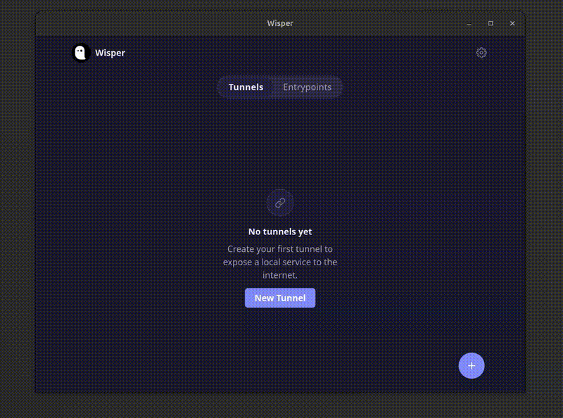

# 🪄 Wisper

**GOST tunnel manager** — a self-hosted web UI and API for creating and managing reverse proxy tunnels through the [GOST](https://github.com/go-gost/gost) network.

**Silent in · Silent out.** / 静入 · 静出

Expose local services to the public internet without opening firewall ports. Wisper handles the tunnel lifecycle — create, start, stop, update, and monitor — through a browser-based UI.

<p align="center">
  <a href="https://chromewebstore.google.com/detail/wisper-tunnel/ahlnngkgaoapogmejamomgjelgiekpgf">
    
  </a>
</p>



## Features

- **5 tunnel types** — File server, HTTP reverse proxy, TCP relay, UDP relay, P2P
- **4 entrypoint types** — TCP, UDP, P2P and TUN endpoints
- **P2P mode** — reach a service by public key over a DERP relay, preferring a direct hole-punched path and falling back to the relay, with a per-tunnel inbound allowlist
- **TUN entrypoint** — join a peer's virtual network through a tun device (spoke)
- **Real-time stats** — bytes in/out per second, connection counts, per-tunnel rates
- **Event history** — start/stop/update and peer-transport events, per object and host-wide, surviving restarts
- **Traffic inspection** — HTTP / WebSocket records from an external inspector service
- **Dark / light theme** — CSS custom properties, auto-detected from OS preference
- **i18n** — English and Chinese
- **Single binary** — Go backend with embedded Lit web UI, ~15 MB
- **Graceful state management** — tunnels persist across restarts, auto-resume on startup
- **Linux, macOS, Windows, Android, Chrome** — cross-compiled Go binary + Tauri desktop shell + APK + [Chrome Extension](https://chromewebstore.google.com/detail/wisper-tunnel/ahlnngkgaoapogmejamomgjelgiekpgf)

## Quick Start

```bash
# Build and run
make web
go build -o wisper .
./wisper

# Open http://localhost:8900 in your browser
```

Or with a custom port:

```bash
./wisper -addr :9000
```

Print version:

```bash
./wisper -version
```

## Tunnel Types

### Tunnels (local → public)

| Type | Description | Default Entrypoint |
|------|-------------|-------------------|
| **File** | Serve a local directory over HTTPS | `https://<hash>.gost.run` |
| **HTTP** | Expose a local HTTP service | `https://<hash>.gost.run` |
| **TCP** | Relay a raw TCP connection | `tcp://<hash>.gost.run:<port>` |
| **UDP** | Relay a raw UDP connection | `udp://<hash>.gost.run:<port>` |
| **P2P** | Expose a local service to peers by public key (private p2p mode) | Dialed by peer key over the DERP relay, no public URL |

### Entrypoints (public → local)

| Type | Description |
|------|-------------|
| **TCP** | Listen locally and forward into a GOST tunnel |
| **UDP** | Same as TCP entrypoint, with keepalive + TTL support |
| **P2P** | Forward local traffic to a peer by its public key, over an inner `tcp` (default) or `udp` protocol |
| **TUN** | Join a peer's virtual network through a tun device (spoke; needs admin rights) |

P2P tunnels and entrypoints require a [DERP relay](#p2p) configured in Settings.
A p2p tunnel routes only the peers on its allowlist (the key is the credential);
a tun entrypoint needs administrator rights to create the tun device.

## Configuration

Config file: `~/.config/wisper/wisper.yaml` (YAML)

- **Server settings** — listen address, GOST relay server
- **Tunnel state** — persisted tunnel/entrypoint objects, auto-restored on startup
- **App settings** — language, theme, entrypoint endpoint

Logs: `~/.config/wisper/logs/wisper.log` (JSON format, 10 MB rotation, 7-day retention)

For containers and manual debugging, `-log.output` and `-log.level` — or the
`WISPER_LOG_OUTPUT` / `WISPER_LOG_LEVEL` env vars — override the config file for
that run only (nothing is written back to it). Precedence: flag > env > config.

```bash
wisper -log.output stderr -log.level debug
WISPER_LOG_LEVEL=debug wisper
```

The Docker image sets `WISPER_LOG_OUTPUT=stderr`, so `docker logs` shows output;
`docker run -e WISPER_LOG_OUTPUT=<path>` (or `-log.output <path>`) sends it back
to a file.

### P2P

Private p2p tunnels, entrypoints and tun spokes share one deployment-level p2p
host. Set its relay in Settings → P2P, or in the config file:

```yaml
p2p:
  derp: wss://relay.example.com/derp  # DERP relay URL (required for p2p)
  secure: true                        # verify the relay's TLS certificate (default: true)
  caFile: /path/to/ca.pem             # trust a self-signed relay
  stun: relay.example.com:3478        # STUN for the IPv4 direct path (default: derived from the relay host)
  direct: true                        # try a hole-punched path first, fall back to the relay (default: true)
```

The p2p host's public key (shown on the P2P settings page) is this instance's
identity; peers dial it directly and no public URL is assigned.

### Inspector

Traffic inspection is served by an external [inspector](https://github.com/go-gost/inspector)
instance. Set its base URL in Settings → Inspector; a **Traffic Inspection**
entry then appears on tunnel detail pages. Empty disables the feature.

## REST API

All routes under `/api/`:

| Method | Route | Description |
|--------|-------|-------------|
| `GET` | `/api/tunnels` | List all tunnels |
| `POST` | `/api/tunnels` | Create tunnel |
| `GET` | `/api/tunnels/{id}` | Get one tunnel |
| `PUT` | `/api/tunnels/{id}` | Update tunnel (replaces + restarts) |
| `DELETE` | `/api/tunnels/{id}` | Delete tunnel |
| `POST` | `/api/tunnels/{id}/start` | Start a stopped tunnel |
| `POST` | `/api/tunnels/{id}/stop` | Stop a running tunnel |
| `PUT` | `/api/tunnels/{id}/peers` | Update a p2p tunnel's peer allowlist + aliases |
| `POST` | `/api/tunnels/{id}/stats/reset` | Reset a tunnel's stats baseline |
| `GET` | `/api/entrypoints` | List all entrypoints |
| `POST` | `/api/entrypoints` | Create entrypoint |
| `GET` | `/api/entrypoints/{id}` | Get one entrypoint |
| `PUT` | `/api/entrypoints/{id}` | Update entrypoint |
| `DELETE` | `/api/entrypoints/{id}` | Delete entrypoint |
| `POST` | `/api/entrypoints/{id}/start` | Start a stopped entrypoint |
| `POST` | `/api/entrypoints/{id}/stop` | Stop a running entrypoint |
| `POST` | `/api/entrypoints/{id}/stats/reset` | Reset an entrypoint's stats baseline |
| `GET` | `/api/stats` | Aggregated stats for all tunnels + entrypoints |
| `GET` | `/api/events` | Host-level event history |
| `DELETE` | `/api/events` | Clear the host-level event history |
| `GET` | `/api/p2p` | This host's p2p identity (public key, status) |
| `POST` | `/api/p2p/test` | Probe the configured DERP relay |
| `POST` | `/api/p2p/test-stun` | Probe the STUN server |
| `GET` | `/api/p2p/pending` | Peers that knocked but are not allowlisted |
| `DELETE` | `/api/p2p/pending/{key}` | Dismiss a pending peer |
| `GET` | `/api/p2p/doctor` | The p2p diagnostic report as plain text (`?peer=` narrows it to one peer) |
| `GET` | `/api/version` | Version info |
| `GET` | `/api/config` | Get app settings |
| `PUT` | `/api/config` | Update app settings |

### Request correlation: `Wisper-Id`

A client may send a short opaque id on any request:

```
Wisper-Id: 3f9a1c2b
```

The backend logs it on the mutation line (`id=…`, at debug level) and the p2p
seam logs it (`action=…`) on the calls that action started — the host's
`Listen`, and each peer's `Warm`/`Punch` — so a UI click can be joined with the
p2p work it set in motion. The web UI sends a fresh id on every request.

An absent header gets a generated id (8 hex chars), so a `curl`, the CLI, or an
older bundle is still correlatable. The value is a **label only**: it is never
authentication, never parsed, and never able to change behaviour.

Correlation covers the calls an action *initiates*. p2p's background logs
(punch rounds, session death, keepalive) stay action-free: one punch serves
every caller and a session outlives any click, so tagging them would be a
fabricated join.

## Build

### Prerequisites

- Go 1.26+
- Node.js 22+
- Python 3 + Pillow (for icon generation)
- Docker (for Android APK + desktop installers)

### Docker

```bash
# Run from Docker Hub
docker run -p 8900:8900 -v ~/.config/wisper:/root/.config/wisper gogost/wisper:latest
```

### Build all platforms

```bash
# Go binaries for Linux, macOS, Windows
make all

# Output: dist/linux-amd64/wisper, dist/darwin-arm64/wisper, etc.
```

### Web UI only

```bash
make web        # conditional rebuild (stamp-based — skips if no changes)
make web-force  # force rebuild
make typecheck  # type-check TypeScript (tsc --noEmit)
make ui-test    # Playwright UI e2e against a real wisper binary
```

### Desktop app (Tauri 2)

```bash
# Linux .deb + .AppImage (Docker cross-compile)
make linux-installer

# Windows NSIS installer (Docker cross-compile)
make windows-installer

# Development mode (hot-reload frontend + sidecar)
make tauri-dev
```

### Android APK

```bash
# Debug APK (pulls the prebuilt toolchain image; no host Node/Go/Android SDK needed)
make android          # → dist/android/app-debug.apk

# Build the toolchain image locally when the registry is unreachable
make android-image    # ANDROID_IMAGE / ANDROID_OUT override image and output dir

# Release APK (signed, needs keystore secrets)
make android-release
```

`make android` runs one multi-stage `docker build`: a `node:22` stage builds the
web UI, the toolchain image builds `libwisper.so` via the NDK and the APK via
Gradle, and a `scratch` stage hands back just the APK.

A VPN handed to another app (the user switching to it) stops the tun entrypoint
that held the device instead of racing the other app for it; a revoke with no
other VPN keeps the automatic re-establish.

## Architecture

```
┌─────────────────────────────────────────────┐
│                  Browser                     │
│         (Lit web UI on localhost)            │
└──────────────────┬──────────────────────────┘
                   │ HTTP /api/*
┌──────────────────▼──────────────────────────┐
│              Go HTTP Server                   │
│  ┌─────────┐  ┌──────────┐  ┌─────────────┐ │
│  │  API    │  │  Runner  │  │  Web (SPA)   │ │
│  │ handlers│  │ (stats)  │  │  //go:embed  │ │
│  └────┬────┘  └──────────┘  └─────────────┘ │
│       │                                       │
│  ┌────▼────────────────────────────────────┐ │
│  │           Tunnel Manager                 │ │
│  │  File │ HTTP │ TCP │ UDP │ P2P │ Entrypts│ │
│  └────┬────────────────────────────────────┘ │
└───────┼──────────────────────────────────────┘
        │ WSS / GOST relay
┌───────▼──────────┐
│  GOST Network    │
│(wisper.gost.run) │
└──────────────────┘
```

Wisper is a **single Go module** (`github.com/go-gost/wisper`). The Lit web app (`web-src/`) compiles to `web/` via Vite and is embedded into the Go binary via `//go:embed`.

### Go package layout

| Package | Purpose |
|---------|---------|
| `main` | Entry point, flag parsing, server lifecycle |
| `web.go` | Embeds web build, serves SPA |
| `config/` | Settings + tunnel persistence (atomic, thread-safe) |
| `tunnel/` | Tunnel interface + 5 tunnel types (incl. p2p) + chain builder |
| `tunnel/entrypoint/` | TCP/UDP/P2P/TUN entrypoint types |
| `event/` | Bounded per-object + host event history, persisted with the config |
| `api/` | REST handlers (Go 1.22+ ServeMux with method routing) |
| `runner/` | Background task scheduler with cancel-by-ID |
| `runner/task/` | Stats polling task |
| `version/` | Version string (set via ldflags) |

### Web app stack

- **Lit** — Web Components with reactive state
- **@lit-labs/router** — SPA routing with lazy-loaded pages
- **Vite** — Build tool with dev proxy to Go backend
- **CSS custom properties** — Light/dark theme system
- **Module-level stores** — Subscribe/notify pattern, zero dependencies

## License

MIT
